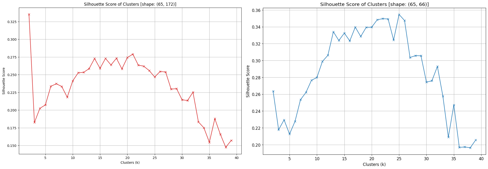
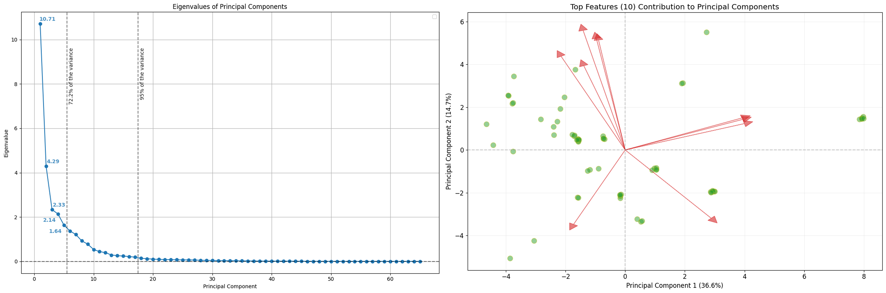
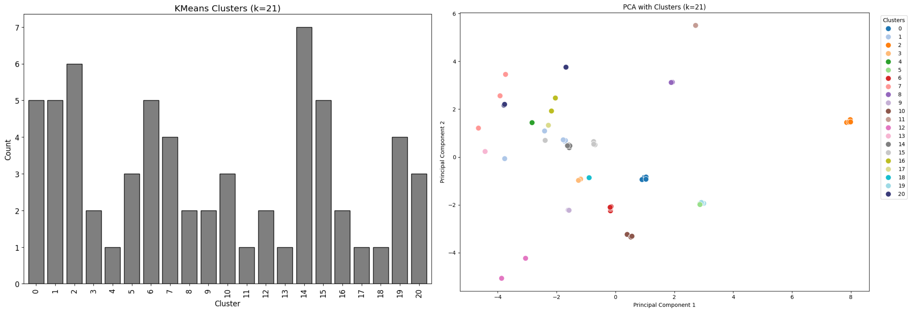
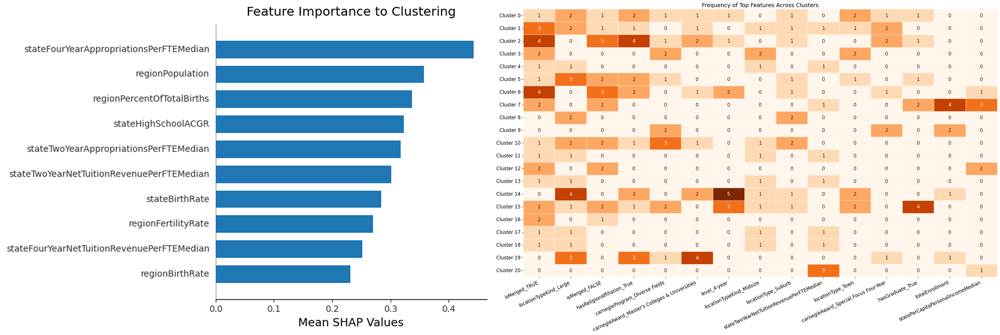
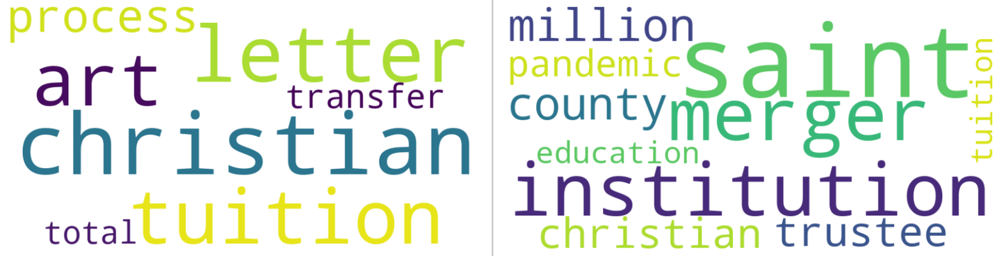

Sepehr Akbari 
Advisor: Dr. Sara Jamshidi 
James Rocco Project '25 
Jun 27th, 2025

# Mid-Project Report

## **Introduction**

Understanding the escalating trend of higher education institution closures necessitates a highly nuanced perspective, similar to the complexity required to analyze city traffic. Just as traffic congestion is a product of intricate interactions among infrastructure, urban planning, and public transportation, rather than merely the volume of vehicles, college closures extend far beyond the simplistic explanation of declining birth rates. Our research directly challenges this pervasive assumption. We embark on a meticulous investigation of diverse institutional characteristics and critical state and regional factors, employing advanced modeling to discern the most influential predictors and forge a truly comprehensive understanding of this pivotal educational shift—the enrollment cliff.

Our work builds on the foundational research of Nathan Grawe [(1)](#references), who has extensively documented the demographic headwinds facing higher education. Yet, our objective is to transcend existing analyses by integrating a significantly wider array of variables, including detailed financial health, academic programming, and localized economic conditions, and by deploying advanced analytical methodologies such as machine learning and Bayesian techniques. This robust framework is set to yield deeper, actionable insights into the complex drivers underpinning college closures.

## **Related Work**

The existing literature on higher education institution closures primarily centers around the anticipated "enrollment cliff," largely attributed to demographic shifts as articulated by Grawe [(1)](#references). This widely accepted perspective posits a looming decline in college-aged populations, creating significant challenges for institutions reliant on traditional enrollment models. While demographics form the bedrock of this concern, recent research, such as Lo and Yong [(2)](#references), underscores the compounding impact of external shocks like the COVID-19 pandemic, which further disrupted enrollment patterns and accelerated existing vulnerabilities. However, not all perspectives align with an inevitable decline; some, like Seybold [(3,4)](#references), offer a more controversial take, questioning the severity of the cliff and emphasizing the influence of factors like racial shifts on future enrollment trends.

In response to these pressures, a dominant theme in the literature revolves around institutional adaptation and strategic shifts. Carey [(5)](#references) suggests colleges will need to deconstruct traditional models, increasing focus on job-oriented programs, catering to adult learners, and leveraging resources like athletics, though he warns of potential diminishment of humanities and exacerbation of existing educational divides. Schuette [(6)](#references) and Campion [(7,8)](#references) further expand on actionable strategies, emphasizing student retention, aligning programs with labor market demands, effective outreach to non-traditional high school graduates, and streamlining the application-to-enrollment process. Beyond demographic responses, other crucial drivers of closure identified include financial health [(9,10)](#references) and geographic vulnerability [(11)](#references), indicating that institutional resilience is tied to a complex interplay of internal and external factors.

However, the discourse is not without its critiques. Busch [(12)](#references) challenges the prevailing focus on "for-employment education" and neoliberal economics within higher education, arguing for a broader mission beyond immediate labor market demands. Conversely, the importance of education as an export for the U.S. economy is also highlighted [(13)](#references). Ultimately, while the demographic enrollment cliff remains a significant concern, the literature increasingly reflects a nuanced understanding that institutional closures are a multifactorial problem, driven by a confluence of financial health, operational strategies, market relevance, and external shocks, with significant consequences for student outcomes [(14)](#references).

In this project, we aim to approach this topic with a fresh perspective, utilizing data-driven analysis and modeling to uncover the complex interplay of factors leading to institutional closures. We believe the insights gained from this research will not only contribute to the academic discourse to develop data-driven strategies for institutional adaptation but also provide actionable recommendations for higher education leaders navigating this evolving landscape.

## **Data**

A critical component of this research involved curating a robust dataset to characterize both individual higher education institutions and their broader state- and regional-level contexts. For this purpose, two high-quality datasets were meticulously constructed. The first encompassed comprehensive institutional characteristics, ranging from location, size, and focus to trusted classifications, endowment figures, and the officially reported reasons for closure [(15,16,17,18)](#data-sources). The second dataset captured crucial state- and regional-level demographic and economic indicators, including birth rates, and, importantly, academic appropriations, revenues, and graduation rates. These contextual variables were vital for understanding the operational environment of these institutions [(18,19,20,21,22)](#data-sources). The combination of these sources yielded a comprehensive dataset, which underwent rigorous cleaning and preprocessing to ensure accuracy, consistency, appropriate handling of missing values, and necessary transformations for subsequent analysis.

## **Dimensionality Reduction**

Our analysis, spanning 2020 to 2025 and encompassing 64 closed higher education institutions, commenced with a dataset of high dimensionality, with 65 observations and 172 variables. To manage this complexity and prepare the data for subsequent modeling, we initiated a crucial dimensionality reduction process. This involved a rigorous phase of feature engineering and selection, which included addressing multicollinearity and carefully dropping variables that were redundant or highly correlated. Through this effort, coupled with techniques applied during the encoding steps, we successfully reduced the feature set from 172 to a more manageable 66 variables, resulting in a modeling data frame of `(65, 66)`. Even after this initial reduction, the dataset remained high-dimensional, considering the number of observations were simply not sufficient to support the full complexity of the feature set. So although this initial reduction proved instrumental for our clustering efforts, we decided to use the Silhouette score, instead of the more traditional elbow method, to determine the optimal number of clusters (`k`). As demonstrated by the comparative Silhouette score plots (*Figure 1*, left vs. right), clustering effectiveness significantly improved. For the reduced dataset, an optimal number of `k`=21 clusters was identified, yielding a robust Silhouette score of 0.3483. This score does not necessarily indicate a perfect clustering solution, but it is a substantial improvement over the original dataset's score of ~0.33 with `k`=2, ignoring most of the complexity in the data, and taking away the potential for a nuanced grouping.

Following this, we performed a Principal Component Analysis (PCA) to further reduce dimensionality and facilitate visualization. The scree plot (*Figure 2*, left) illustrates the variance captured by each principal component. While the first five components collectively explain a substantial 72.2% of the total variance, providing a strong representation of the data's core structure, we strategically opted to retain 17 principal components to ensure the capture of 95% of the total variance. This decision was made to preserve more nuanced information crucial for understanding the complex factors at play.

The accompanying PCA biplot (*Figure 2*, right) visually represents our colleges and the top 10 features with the strongest contributions to the first two principal components, which collectively capture 51.3% of the total variance. The green markers denote individual institutions, with their proximity indicating similarity based on underlying characteristics. The red vectors represent the original features; their direction reveals the correlation with the principal components (e.g., vectors pointing right are positively correlated with Component 1), while their length signifies the magnitude of their influence. This visualization is invaluable for identifying the key underlying patterns and the most impactful variables that differentiate institutions in our dataset.

## **Clustering**

To reveal inherent patterns and typologies within our dataset, we employed K-Means clustering to group institutions based on their diverse characteristics. The optimal number of clusters, determined to be 21 using the Silhouette score, allowed for a meaningful segmentation where each cluster represents a unique archetype defined by a distinct combination of institutional attributes and state- and regional-level factors.

*Figure 3* provides a clear visualization of these clustering outcomes. The left panel provides a distribution of institutions across the 21 identified clusters. This bar chart is crucial for understanding the relative sizes of each distinct institutional archetype, showing us whether certain profiles are more common than others. Complementing this, the right panel projects these clusters onto the first principal components, which together explain over 50% of the data's variance. This visualization allows us to see how spatially separated and distinct these clusters are in a lower-dimensional space, indicating that institutions within a cluster share commonalities in significant underlying features, while institutions in different clusters are indeed characterized by different attribute combinations. By identifying these unique groupings, we gain a more granular understanding of the diverse landscape of higher education and can better analyze which specific institutional characteristics and external factors, often nuanced within these clusters, contribute to the risk of closure.

To further elucidate the defining characteristics of these clusters, we utilized a Shapley Additive Explanation (SHAP) analysis, a robust method for interpreting machine learning model outputs. The left panel of *Figure 4* presents the mean SHAP values, offering insights into the overall contribution of each feature to the clustering results. Notably, this analysis provided critical insights, corroborating our hypothesis that factors beyond simply declining birth rates significantly influence institutional profiles and, by extension, their vulnerability. Furthermore, the right panel of *Figure 4*, a heatmap illustrating the frequency of top features across the clusters, reveals the most common characteristics defining each institutional archetype, providing a deeper understanding of their underlying composition.

A comparative analysis of these findings against Grawe's foundational work yields several key insights. Our results confirm his observation regarding the paramount importance of regional demographics over state-level demographics, suggesting that local context may exert a stronger influence than broader state legislation. However, our analysis also highlights the significant and novel importance of state-level academic appropriations and revenues, factors not as prominently emphasized in his work. Additionally, the Average Cohort Graduation Rate (ACGR), a proxy for the overall college-going readiness and quality of a state's high school graduates, emerged as a significant factor, underscoring the critical role of student quality in addition to mere quantity.

## **Characterizing Closure Profiles**

To effectively characterize and ultimately predict the diverse reasons for institutional closure, we employed Linear Discriminant Analysis (LDA). LDA, a supervised dimensionality reduction technique, is specifically designed to find linear combinations of features that optimally separate two or more predefined classes. In this application, the LDA model was trained using the distinct reasons for institutional closure as the target variable, and its effectiveness in differentiating these categories is strikingly demonstrated by the resulting projection.

As illustrated in the LDA plot (*Figure 5*), targeting `Closure Reason` as the dependent variable, our features exhibit clear discriminatory power in separating various closure outcomes. Each point on the plot represents an individual institution, color-coded by its primary reason for closure. The visually evident clustering of similarly colored points, coupled with their distinct separation from other groups, strongly indicates that the underlying institutional and contextual factors integrated into our analysis effectively differentiate these reasons. For instance, the `Financial` and `Enrollment` clusters are notably distinct, suggesting that institutions facing financial distress possess characteristic profiles different from those primarily struggling with enrollment. Furthermore, the plot highlights how certain clear-cut reasons, such as `Mutual Benefit` (typically mergers or acquisitions), form tight, well-defined groups. In contrast, more complex categories like `Financial and Enrollment and Pandemic` might occupy a less compact, central region, reflecting the compounded pressures driving these closures. This robust separation provided by LDA underscores the high relevance of our chosen features in dissecting the distinct pathways to institutional closure, thereby offering a strong foundation for more targeted analysis or predictive modeling.

## **Behind the Numbers...**

To fully capture the multifaceted nature of institutional closures and delve deeper "behind the numbers" of quantitative data, we sought to understand the qualitative narratives surrounding these events. Our investigation turned to media reports, aiming to uncover the perspectives of institutions themselves, their students, state officials, and the general public. For this purpose, we employed Latent Dirichlet Allocation (LDA) for topic modeling, a technique adept at extracting latent thematic structures from large volumes of unstructured text data. This allowed us to identify the most commonly discussed topics in articles reporting on these closures, both across the entire corpus and for individual institutions.

*Figure 6* showcases two representative topics identified by our preliminary LDA model from the media articles. While further fine-tuning of the model is ongoing, these initial results offer illuminating insights into the prevailing themes and stakeholder concerns frequently raised in the media coverage of these closures. The word clouds provide a compelling visual glance into the distinct common themes, hinting at diverse reasons and impacts that extend beyond purely statistical indicators, thereby complementing our quantitative findings with rich qualitative context.

## **Conclusion**

Our initial findings compellingly underscore the multifaceted nature of higher education institution closures, decisively moving beyond the oversimplified narrative that attributes this complex phenomenon solely to declining birth rates. The preliminary analyses, from nuanced dimensionality reduction and robust clustering to the discerning power of Linear Discriminant Analysis, provide a clear empirical foundation, revealing that diverse institutional characteristics and contextual factors are critical determinants of an institution's vulnerability and its specific pathway to closure. This initial exploration has laid groundwork, affirming our core hypothesis that a holistic, data-driven approach is indispensable for truly comprehending this trend.

In the coming weeks, our research will delve deeper, rigorously dissecting each identified institutional cluster and the distinct LDA-derived closure categories to uncover the precise factors that define their formation and the unique risks associated with each. Crucially, we will develop a Bayesian Hierarchical Model (BHM), a sophisticated predictive framework designed to quantify closure risk based on our comprehensive set of variables. This will not only offer a robust statistical forecast but also yield actionable, data-driven insights for policymakers and higher education leaders grappling with the challenges of institutional sustainability. Concurrently, the topic analysis, leveraging the LDA model, will be further refined to extract even more granular and meaningful insights from media coverage, culminating in a truly comprehensive and actionable understanding of the evolving higher education closure landscape.

## **References**

1. Grawe, N.D. (2018). Demographics and the Demand for Higher Education. Johns Hopkins University Press. [DOI](https://doi.org/10.1353/book.57044)

2. Lo, J. H., & Yong, F. (2021). Impact of COVID-19 on College Admissions and High Schoolers' Well-Being. American Statistical Association, Social Statistics Section. [URL](https://ww2.amstat.org/meetings/proceedings/2021/data/assets/pdf/1913750.pdf)

3. Seybold, M. (2024). Putting The "If" In "Enrollment Cliff". The American Vandal. [URL](https://theamericanvandal.substack.com/p/putting-the-if-in-enrollment-cliff)

4. JonBenet_Palm. (2024). Anybody seen this take on the enrollment cliff?. Reddit. [URL](https://www.reddit.com/r/Professors/comments/1b613ke/anybody_seen_this_take_on_the_enrollment_cliff/)

5. Carey, K. (2022, November). The Incredible Shrinking Future of College. Vox. [URL](https://www.vox.com/the-highlight/23428166/college-enrollment-population-education-crash)

6. Schuette, A. (2023). Navigating the Enrollment Cliff in Higher Education. Trellis Company. [URL](https://eric.ed.gov/?id=ED628984)

7. Campion, L. L. (2020). Leading Through the Enrollment Cliff of 2026 (Part I). TechTrends. [URL](https://doi.org/10.1007/s11528-020-00492-6)

8. Campion, L. L. (2022). Leading Through the Enrollment Cliff of 2026 (Part II). TechTrends. [URL](https://doi.org/10.1007/s11528-021-00688-4)

9. Doyle, J. (2024). Colleges Most Likely to Close - Based on 2024 Forbes' Financial Health Failing Grades. deepthoughtshed. [URL](https://deepthoughtshed.com/2024/12/29/colleges-most-likely-to-close-based-on-2024-forbes-financial-health-failing-grades/)

10. Whitford, E. (2024). College Financial Grades: America's Strongest And Weakest Schools. Forbes. [URL](https://www.forbes.com/sites/emmawhitford/2024/08/03/forbes-2024-college-financial-grades-americas-strongest-and-weakest-schools/)

11. O'Neil, S. (2020). The Geography of Campus Closures: Mapping at-risk Metro Areas, & how to implement intervention strategies. u3advisors. [URL](https://www.u3advisors.com/insights/where-will-americas-colleges-close-its-doors/)

12. Busch, L. (2017). Knowledge for Sale: The Neoliberal Takeover of Higher Education. The MIT Press. [DOI](https://doi.org/10.7551/mitpress/10742.001.0001)

13. U.S. Department of Commerce. (2024). U.S. Education Service Exports. International Trade Administration. [URL](https://www.trade.gov/education-service-exports)

14. Burns, R., et al. (2022). A Dream Derailed? Investigating the Impacts of College Closures on Student Outcomes. State Higher Education Executive Officers Association (SHEEO). [URL](https://eric.ed.gov/?id=ED627227)

 

### ***Data Sources***

15. Integrated Postsecondary Education Data System (IPEDS). U.S. Department of Education, National Center for Education Statistics (NCES). [URL](https://nces.ed.gov/ipeds/) (Accessed: May 28, 2025)

16. NACUBO-TIAA Study of Endowments (NTSE). TIAA Institute, NACUBO. [URL](https://www.tiaa.org/public/institute/publication/2022/nacubo-and-tiaa-study-endowments) (Accessed: May 28, 2025)

17. Carnegie Classification of Institutions of Higher Education. American Council on Education (ACE). [URL](https://carnegieclassifications.acenet.edu/) (Accessed: Jun 2, 2025)

18. Data USA. U.S. data visualization and analysis platform. [URL](https://datausa.io/) (Accessed: May 28, 2025)

19. High School Graduation Rates. U.S. Department of Education, Integrated Postsecondary Education Data System (IPEDS), NCES. [URL](https://nces.ed.gov/programs/coe/indicator/coi/high-school-graduation-rates) (Accessed: Jun 6, 2025)

20. Regional Data: GDP and Personal Income. Bureau of Economic Analysis, U.S. Department of Commerce. [URL](https://apps.bea.gov/itable/?ReqID=70&step=1) (Accessed: Jun 6, 2025)

21. State unemployment rates. Bureau of Labor Statistics, U.S. Department of Labor. [URL](https://www.bls.gov/charts/state-employment-and-unemployment/state-unemployment-rates-map.htm) (Accessed: Jun 6, 2025)

22. CDC Wonder: Natality Information. Center for Disease Control and Prevention, U.S. Department of Health and Human Services. [URL](https://wonder.cdc.gov/natality.html) (Accessed: Jun 6, 2025)